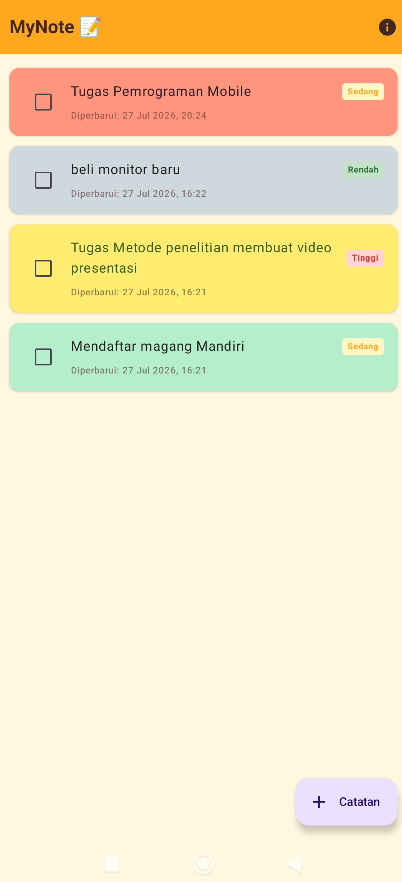
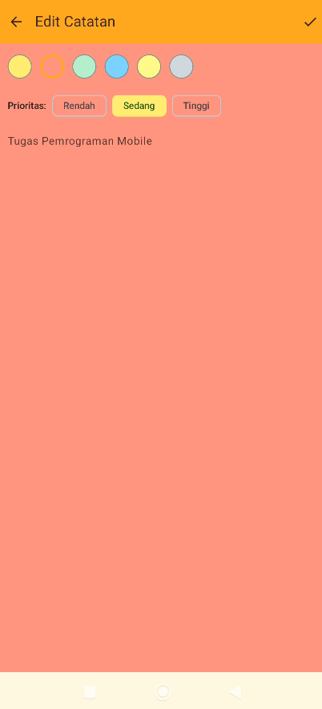
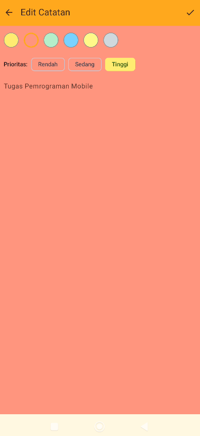
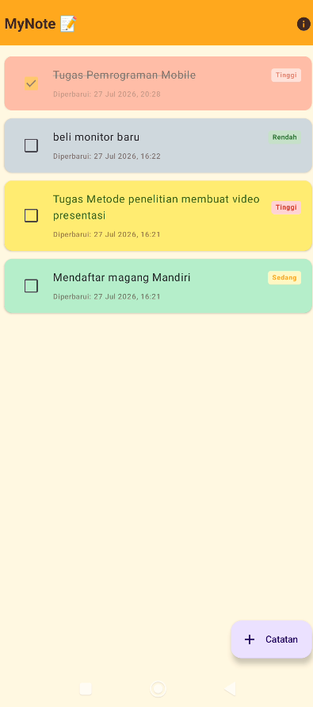
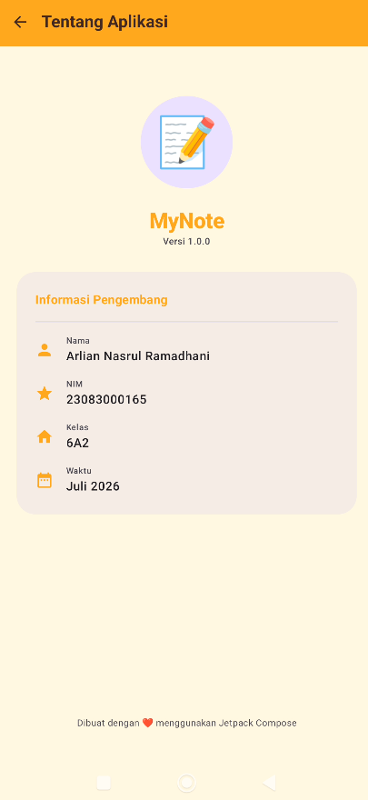

# MyNote 📝 - Aplikasi Sticky Note Jetpack Compose

Aplikasi catatan modern yang dibangun dengan Jetpack Compose, mengikuti arsitektur **ViewModel + StateFlow** untuk manajemen state yang reaktif dan efisien.

## 👤 Informasi Mahasiswa

- **Nama**: Arlian Nasrul Ramadhani
- **NIM**: 23083000165
- **Kelas**: 6A2
- **Waktu**: Juli 2026

---

## ✨ Fitur Utama

### 1. Manajemen Catatan (CRUD)
Pengguna dapat membuat, membaca, dan memperbarui catatan dengan mudah. Data disimpan secara permanen di perangkat.
> **Screenshot Fitur:**
> 

### 2. Penyimpanan Permanen (Persistence)
Menggunakan **SharedPreferences** dan **Gson** untuk menyimpan daftar catatan sehingga data tidak hilang saat aplikasi ditutup atau perangkat dimatikan.

### 3. Kustomisasi Warna
Setiap catatan dapat dipersonalisasi dengan pilihan warna latar belakang yang menarik (6 pilihan warna), memberikan kesan seperti Sticky Notes pada umumnya.
> **Screenshot Fitur:**
> 

### 4. Tingkat Kepentingan (Priority)
Fitur untuk menandai tingkat kepentingan catatan: **Rendah**, **Sedang**, atau **Tinggi**. Setiap tingkatan memiliki badge visual yang berbeda di Dashboard.
> **Screenshot Fitur:**
> 

### 5. Fitur Checklist (Completion)
Pengguna dapat mencentang catatan yang sudah selesai. Catatan yang selesai akan otomatis memiliki efek *strikethrough* (coretan) dan tampilan yang lebih pudar.
> **Screenshot Fitur:**
> 

### 6. Layar "About" Profesional
Informasi pengembang yang disajikan dengan desain kartu yang modern dan bersih.
> **Screenshot Fitur:**
> 

---

## 🛠️ Arsitektur & Teknologi

- **Jetpack Compose**: UI Toolkit deklaratif modern.
- **Navigation Compose**: Navigasi antar layar yang fleksibel.
- **ViewModel & StateFlow**: Arsitektur Unidirectional Data Flow (UDF).
- **Material 3**: Design system terbaru dari Google.
- **SharedPreferences & Gson**: Penyimpanan data lokal yang ringan.

---

## 🚀 Cara Menjalankan

1. Clone repository ini.
2. Buka di **Android Studio Ladybug (2024.2.1)** atau yang lebih baru.
3. Tunggu proses **Gradle Sync** selesai.
4. Jalankan aplikasi pada Emulator atau Perangkat Android asli (Min SDK 26).
